# Lab 7 AREP

Para clonar el proyecto 

git clone  ´ https://github.com/lalaro/LAB7AREP.git ´

### Prerrequisitos

Se necesita de Maven (La versión más reciente) y Java 17, la instalación debe realizarse desde las paginas oficiales de cada programa.

### Instalación

Para Maven debe irse a https://maven.apache.org/download.cgi, descargar la versión más nueva que allá de Maven (En este caso tenemos la versión 3.9.6) y agregarse en la carpeta de Program Files, luego se hace la respectiva configuración de variables de entorno según la ubicación que tenemos para el archivo de instalación, tanto de MAVEN_HOME y de Path.
Luego revisamos que haya quedado bien configurado con el comando para Windows:

` mvn - v `
o
` mvn -version `

Para Java debe irse a https://www.oracle.com/java/technologies/downloads/?er=221886, descargar la versión 17 de Java y agregarse en la carpeta de Program Files, luego se hace la respectiva configuración de variables de entorno según la ubicación que tenemos para el archivo de instalación, tanto de JAVA_HOME y de Path.
Luego revisamos que haya quedado bien configurado con el comando para Windows:

` java -version `

Si no tenemos la versión solicitada podemos hacer lo siguiente, para el caso de Windows:

Ir al Windows PowerShell y ejecutar como administrador los siguientes codigos:

` [System.Environment]::SetEnvironmentVariable("JAVA_HOME", "C:\Program Files\Java\jdk-17", [System.EnvironmentVariableTarget]::Machine) `

Revisar las rutas de la máquina

`  $env:JAVA_HOME = "C:\Program Files\Java\jdk-17" `

`  $env:Path = "C:\Program Files\Java\jdk-17\bin;" + $env:Path `

`  echo $env:JAVA_HOME `

`  javac -version `

`  java -version `

### *Sol del Laboratorio.*
### *Resumen del proyecto:*

### *Arquitectura del sistema:*

### *Detalle de la arquitectura:*

1. Diseñe un API y cree un monolito Spring que permita a los usuarios hacer posts de 140 caracteres e ir registrandolos en un stream único de posts (a la Twitter). Piense en tres entidades Usuario, hilo(stream), posts.

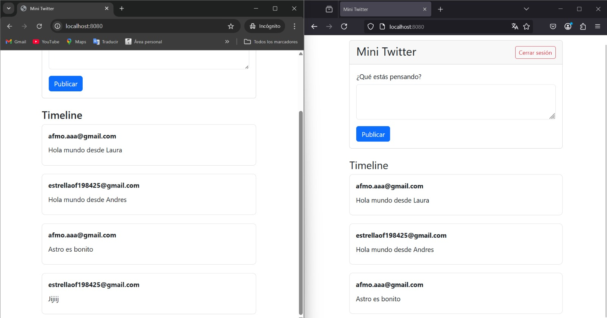

2. Cree un aplicación JS para usar el servicio. Depliegue la aplicación en S3. Asegúrese que esté disponible sobre internet.

Primero se ccrea el S3 en AWS:

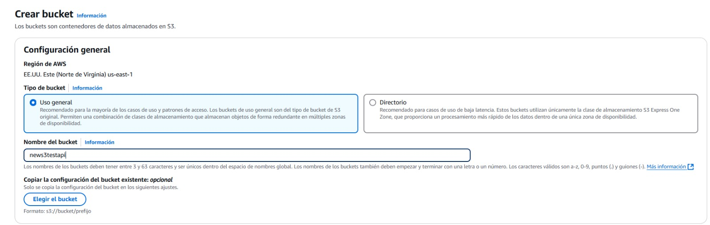
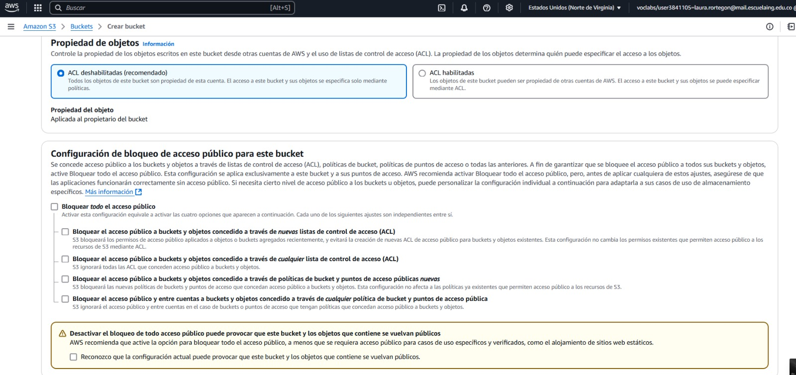
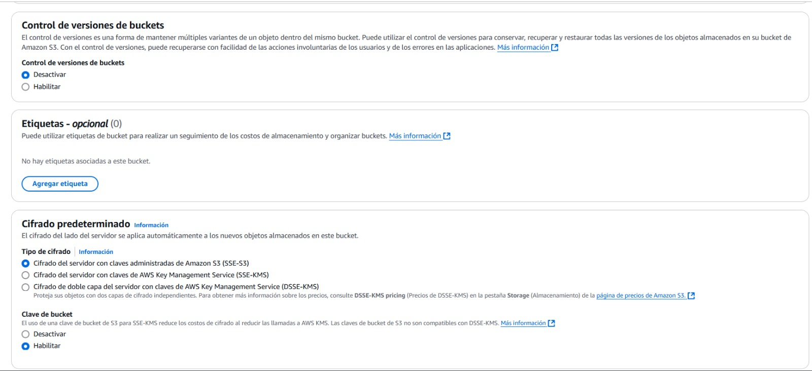
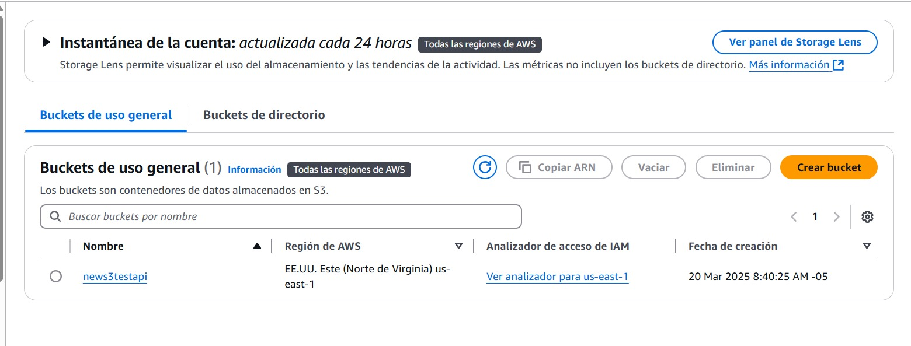
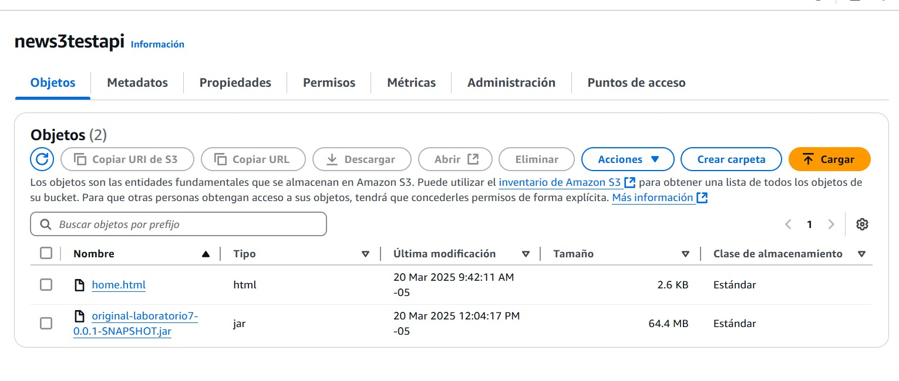

3. Pruebe la aplicación Web

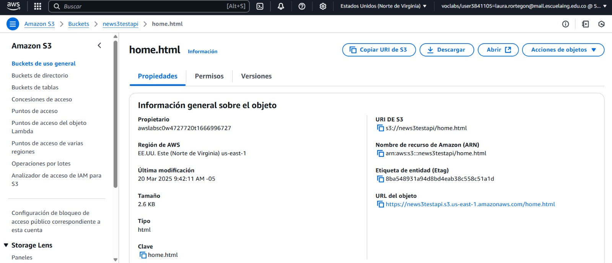
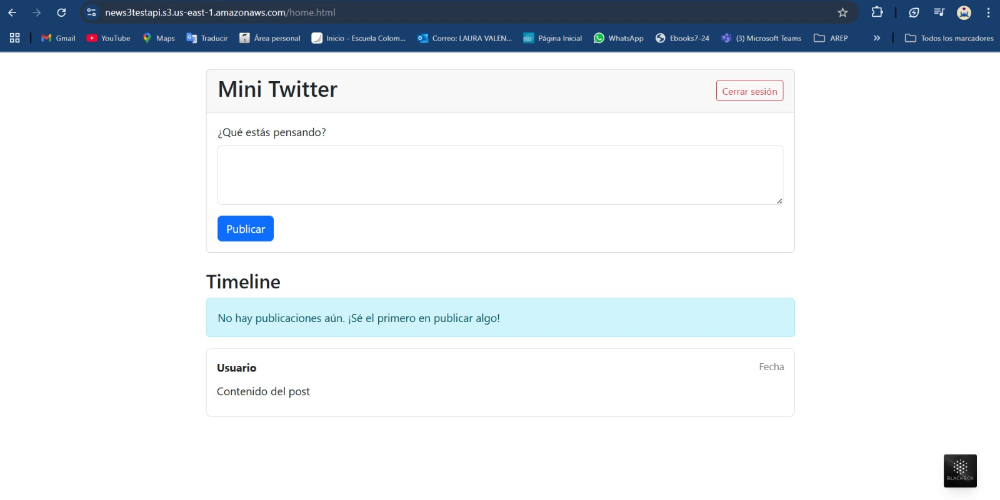

4. Agregue seguridad usando JWT con el servicio cognito de AWS o otra tecnología.

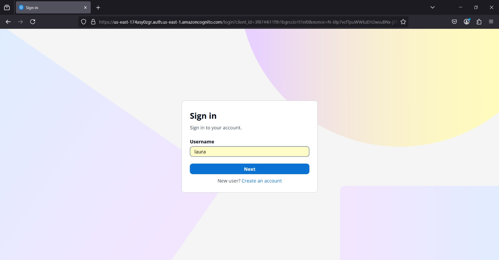
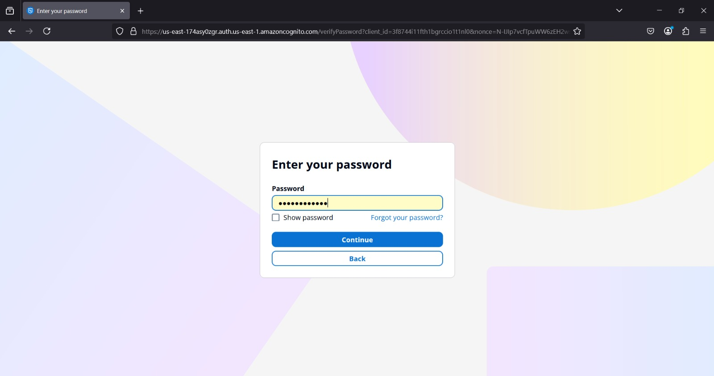

5. Despliegue el servicio en AWS lambda

Por el tamaño del JAR fue necesario crear una instancia en S3 y traerla por el URL.
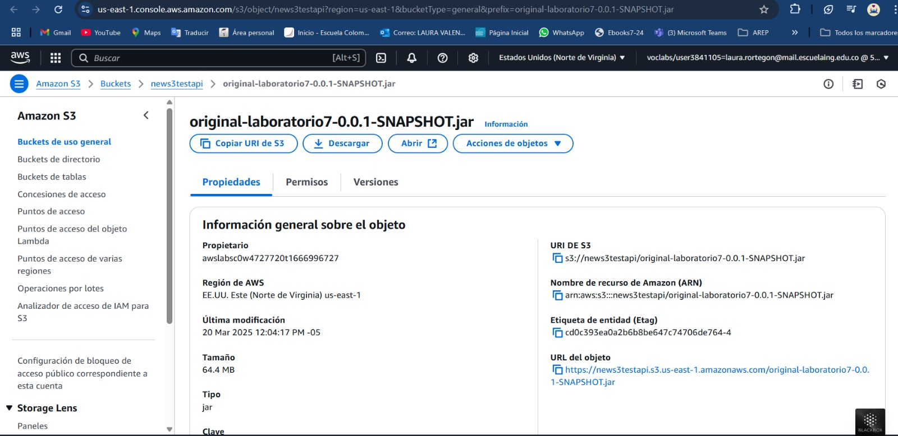
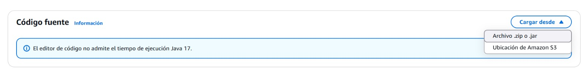
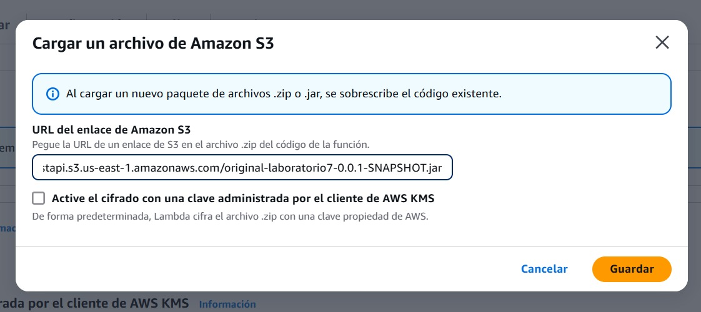
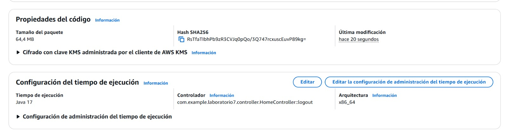

### *Video:*

Video: [Video funcionamiento]()

## Ejecutando las pruebas

Podemos Abrir en terminal el proyecto y ejecutar las pruebas desde el PowerShell, en el caso de Windows. Y ejecutamos el comando:

` mvn test `

O de igual forma en el ID que deseemos.

Así se vera:

### Desglose en pruebas de extremo a extremo

### Y pruebas de estilo de código

## Despliegue

Podemos Abrir en terminal el proyecto y compilar y empaquetar el proyecto desde el PowerShell, en el caso de Windows. Y ejecutamos los comandos:

` mvn clean install `

` mvn spring-boot:run `

O de igual forma en el ID que deseemos.

Así se verá:

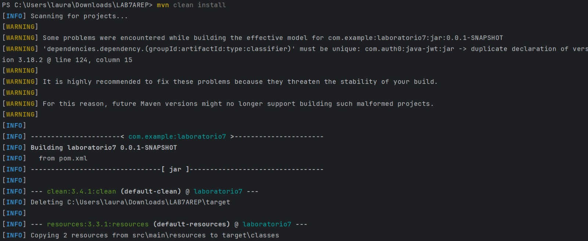
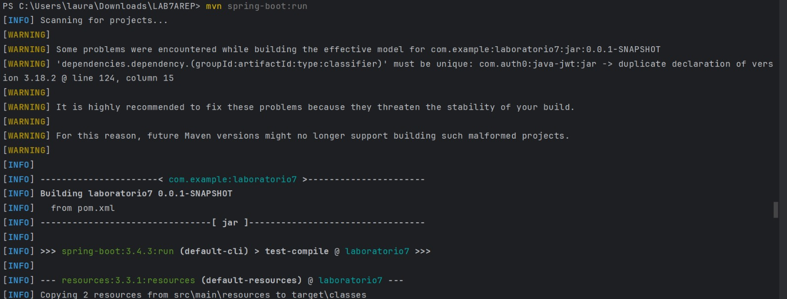

## Construido con

* [Maven](https://maven.apache.org/) - Gestión de dependencias.
* [Java](https://www.java.com/es/) - Versionamiento en Java.
* [GitHub](https://docs.github.com/es) - Sistema de control de versiones distribuido.
* [IntelliJ](https://www.jetbrains.com/es-es/idea/) - Entorno de desarrollo integrado.
* [AWS](https://docs.aws.amazon.com/es_es/) - Amazon Web Services / plataforma de servicios de nube.

## Contribuyendo

Por favor, lee [CONTRIBUTING.md](https://gist.github.com/PurpleBooth/b24679402957c63ec426) para detalles sobre nuestro código de conducta y el proceso para enviarnos solicitudes de cambios (*pull requests*).

## Versionado

Usamos [SemVer](http://semver.org/) para el versionado.

## Autores

* **Laura Valentina Rodríguez Ortegón** - *Lab7 AREP* - [Repositorio](https://github.com/lalaro/LAB7AREP.git)
* **Juan Pablo Fernandez Gonzalez** 
* **Andres Felipe Montes Ortiz**
## Licencia

Este proyecto está licenciado bajo la Licencia MIT - consulta el archivo [LICENSE.md](LICENSE.md) para más detalles.

## Reconocimientos

* Agradecimientos a la Escuela Colombiana de Ingeniería
* La documentación de Git Hub
* Al profesor Luis Daniel Benavides
