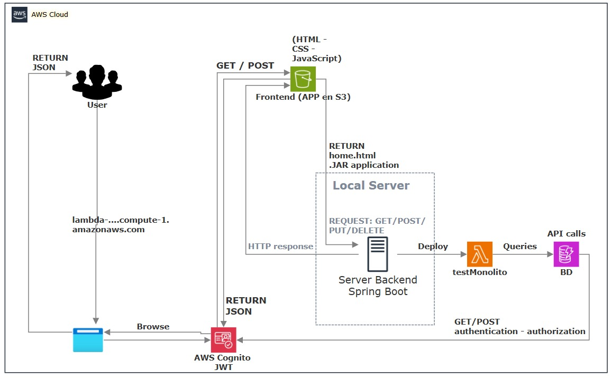
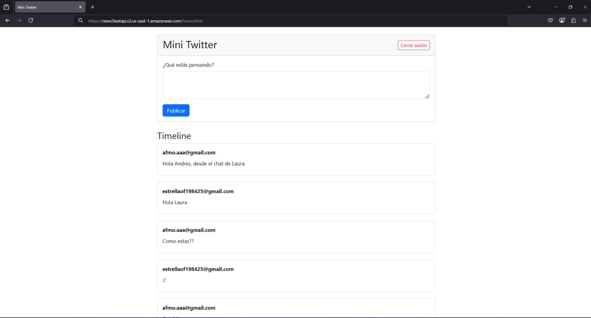
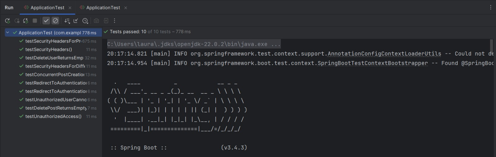
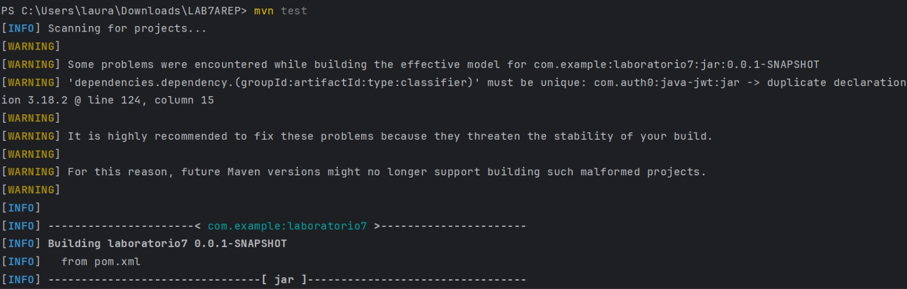
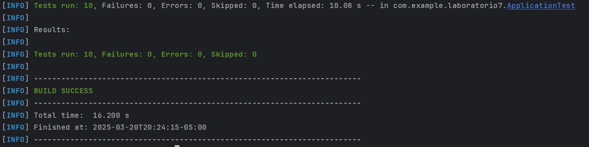

# Lab 7 AREP

Para clonar el proyecto 

git clone  ´ https://github.com/lalaro/LAB7AREP.git ´

### Prerrequisitos

Se necesita de Maven (La versión más reciente) y Java 17, la instalación debe realizarse desde las paginas oficiales de cada programa.

### Instalación

Para Maven debe irse a https://maven.apache.org/download.cgi, descargar la versión más nueva que allá de Maven (En este caso tenemos la versión 3.9.6) y agregarse en la carpeta de Program Files, luego se hace la respectiva configuración de variables de entorno según la ubicación que tenemos para el archivo de instalación, tanto de MAVEN_HOME y de Path.
Luego revisamos que haya quedado bien configurado con el comando para Windows:

` mvn - v `
o
` mvn -version `

Para Java debe irse a https://www.oracle.com/java/technologies/downloads/?er=221886, descargar la versión 17 de Java y agregarse en la carpeta de Program Files, luego se hace la respectiva configuración de variables de entorno según la ubicación que tenemos para el archivo de instalación, tanto de JAVA_HOME y de Path.
Luego revisamos que haya quedado bien configurado con el comando para Windows:

` java -version `

Si no tenemos la versión solicitada podemos hacer lo siguiente, para el caso de Windows:

Ir al Windows PowerShell y ejecutar como administrador los siguientes codigos:

` [System.Environment]::SetEnvironmentVariable("JAVA_HOME", "C:\Program Files\Java\jdk-17", [System.EnvironmentVariableTarget]::Machine) `

Revisar las rutas de la máquina

`  $env:JAVA_HOME = "C:\Program Files\Java\jdk-17" `

`  $env:Path = "C:\Program Files\Java\jdk-17\bin;" + $env:Path `

`  echo $env:JAVA_HOME `

`  javac -version `

`  java -version `

### *Sol del Laboratorio.*

### *Resumen del proyecto:*

El proyecto consistió en el diseño e implementación de una API monolítica en Spring Boot que permite a los usuarios crear y registrar posts de hasta 140 caracteres en un stream único, similar a Twitter. Se definieron tres entidades principales: Usuario, Hilo (stream) y Post, asegurando una estructura clara para la gestión de publicaciones.

Para interactuar con el servicio, se desarrolló una aplicación web que consume la API y permite a los usuarios visualizar y publicar posts en tiempo real. La aplicación fue desplegada en AWS S3, garantizando su disponibilidad en internet.

Se incorporó seguridad mediante JWT con Amazon Cognito para la autenticación de usuarios, protegiendo el acceso a la API y asegurando que solo usuarios autenticados puedan interactuar con la plataforma. Finalmente, el servicio backend fue desplegado en AWS Lambda, permitiendo escalabilidad y disponibilidad en la nube, y se realizaron pruebas de la aplicación web para validar su correcto funcionamiento.

### *Arquitectura del sistema:*

### *Detalle de la arquitectura:*

El diagrama representa la arquitectura de una aplicación web similar a Twitter, desplegada en AWS. Los usuarios interactúan con la plataforma a través del navegador, enviando y recibiendo datos en formato JSON. La aplicación web está alojada en AWS Lambda, donde se ejecuta un proyecto de Spring Boot, eliminando la necesidad de servidores dedicados.

Cuando un usuario inicia sesión, la autenticación es gestionada por AWS Cognito, que devuelve un JWT para autorizar futuras solicitudes. Las interacciones (publicar tweets) son enviadas a Lambda, que procesa las peticiones y se comunica con la base de datos para almacenar o recuperar la información.

El backend en Spring Boot dentro de Lambda responde a las solicitudes con JSON, que es interpretado por el navegador del usuario para actualizar la interfaz. Así, la aplicación se mantiene escalable y eficiente, optimizando costos al ejecutarse solo cuando hay actividad de los usuarios.

1. Diseñe un API y cree un monolito Spring que permita a los usuarios hacer posts de 140 caracteres e ir registrandolos en un stream único de posts (a la Twitter). Piense en tres entidades Usuario, hilo(stream), posts.

2. Cree un aplicación JS para usar el servicio. Depliegue la aplicación en S3. Asegúrese que esté disponible sobre internet.

Primero se ccrea el S3 en AWS:

3. Pruebe la aplicación Web

4. Agregue seguridad usando JWT con el servicio cognito de AWS o otra tecnología.

5. Despliegue el servicio en AWS lambda

Por el tamaño del JAR fue necesario crear una instancia en S3 y traerla por el URL.

### *Video:*

Video:

[VideoChat.mp4](src/main/resources/static/images/VideoChat.mp4)
## Ejecutando las pruebas

Podemos Abrir en terminal el proyecto y ejecutar las pruebas desde el PowerShell, en el caso de Windows. Y ejecutamos el comando:

` mvn test `

O de igual forma en el ID que deseemos.

Así se vera:

Es importante aclarar que algunas pruebas estan configuradas con el JWT, así que una vez se apague puede generar advertencias.

### Desglose en pruebas de extremo a extremo

1. testRedirectToAuthentication

Qué prueba: Verifica si la API redirige a la autenticación en endpoints protegidos.
Por qué la prueba: Asegura que los usuarios no autenticados no puedan acceder a recursos restringidos, protegiendo así la seguridad del sistema.

2. testSecurityHeaders

Qué prueba: Verifica que las cabeceras de seguridad estén presentes en la respuesta del servidor.
Por qué la prueba: Garantiza que la aplicación sigue las mejores prácticas de seguridad HTTP para proteger contra ataques como clickjacking y MIME sniffing.

3. testDeletePostReturnsEmptyResponse

Qué prueba: Verifica que la eliminación de un post devuelve un JSON vacío.
Por qué la prueba: Asegura que la API responde correctamente a las solicitudes de eliminación sin exponer información innecesaria.

4. testRedirectToAuthenticationForOtherRoute

Qué prueba: Verifica si la API redirige a la autenticación en otra ruta protegida.
Por qué la prueba: Confirma que todas las rutas sensibles requieren autenticación antes de permitir el acceso, reforzando la seguridad del sistema.

5. testSecurityHeadersForDifferentRoute

Qué prueba: Verifica que las cabeceras de seguridad están presentes en un endpoint diferente.
Por qué la prueba: Asegura la consistencia de las medidas de seguridad en todas las rutas de la aplicación.

6. testDeleteUserReturnsEmptyResponse

Qué prueba: Verifica que la eliminación de un usuario devuelve un JSON vacío.
Por qué la prueba: Garantiza que la API mantiene un comportamiento coherente en la gestión de recursos eliminados.

7. testSecurityHeadersForProfile

Qué prueba: Verifica que las cabeceras de seguridad están presentes en la página de perfil del usuario.
Por qué la prueba: Asegura que la información del usuario esté protegida contra vulnerabilidades relacionadas con respuestas HTTP.

8. testConcurrentPostCreation

Qué prueba: Verifica que múltiples usuarios pueden crear posts simultáneamente sin problemas de concurrencia.
Por qué la prueba: Garantiza que el sistema maneja correctamente múltiples solicitudes concurrentes sin generar inconsistencias en los datos.

9. testUnauthorizedUserCannotDeletePost

Qué prueba: Verifica que un usuario sin permisos no puede eliminar un post.
Por qué la prueba: Asegura que el control de acceso está correctamente implementado y que solo los usuarios autorizados pueden realizar ciertas acciones.

10. testUnauthorizedAccess

Qué prueba: Verifica que un usuario no autenticado recibe un error 401 al intentar acceder a rutas protegidas.
Por qué la prueba: Confirma que la API impide el acceso a usuarios no autenticados y los redirige al proceso de autenticación.

### Y pruebas de estilo de código

Las pruebas verifican que la API maneja correctamente la autenticación, la seguridad y el control de acceso a los recursos. Evalúan si los usuarios no autenticados son redirigidos al inicio de sesión, garantizan la presencia de cabeceras de seguridad para mitigar vulnerabilidades, y validan que solo los usuarios autorizados puedan realizar acciones sensibles, como eliminar posts o acceder a datos protegidos. Además, aseguran que el sistema pueda manejar múltiples solicitudes concurrentes sin errores y que las respuestas sean coherentes y seguras.

## Despliegue

Podemos Abrir en terminal el proyecto y compilar y empaquetar el proyecto desde el PowerShell, en el caso de Windows. Y ejecutamos los comandos:

` mvn clean install `

` mvn spring-boot:run `

O de igual forma en el ID que deseemos.

Así se verá:

## Construido con

* [Maven](https://maven.apache.org/) - Gestión de dependencias.
* [Java](https://www.java.com/es/) - Versionamiento en Java.
* [GitHub](https://docs.github.com/es) - Sistema de control de versiones distribuido.
* [IntelliJ](https://www.jetbrains.com/es-es/idea/) - Entorno de desarrollo integrado.
* [AWS](https://docs.aws.amazon.com/es_es/) - Amazon Web Services / plataforma de servicios de nube.

## Contribuyendo

Por favor, lee [CONTRIBUTING.md](https://gist.github.com/PurpleBooth/b24679402957c63ec426) para detalles sobre nuestro código de conducta y el proceso para enviarnos solicitudes de cambios (*pull requests*).

## Versionado

Usamos [SemVer](http://semver.org/) para el versionado.

## Autores

* **Laura Valentina Rodríguez Ortegón** - *Lab7 AREP* - [Repositorio](https://github.com/lalaro/LAB7AREP.git)
* **Juan Pablo Fernandez Gonzalez** 
* **Andres Felipe Montes Ortiz**
## Licencia

Este proyecto está licenciado bajo la Licencia MIT - consulta el archivo [LICENSE.md](LICENSE.md) para más detalles.

## Reconocimientos

* Agradecimientos a la Escuela Colombiana de Ingeniería
* La documentación de Git Hub
* Al profesor Luis Daniel Benavides
